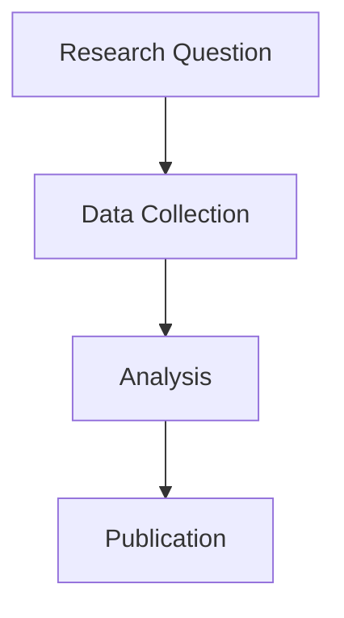

# LBNL Jekyll Template

A professional Jekyll template for Lawrence Berkeley National Laboratory research projects, featuring responsive design, dark mode support, and LBNL brand compliance.

## Features

- **🔬 LBNL Brand Compliant**: Follows official [LBNL Visual Identity Guidelines](https://creative.lbl.gov/visual-identity/)
- **📱 Responsive Design**: Mobile-first Bootstrap framework with Bootswatch themes
- **🌙 Dark Mode**: Automatic system preference detection with manual toggle
- **🎨 Customizable**: Choose from 8+ Bootswatch themes and 9 LBNL accent colors
- **🏢 Sponsor Integration**: Dynamic sponsor logo display from YAML configuration
- **♿ Accessible**: WCAG compliant with proper ARIA labels and keyboard navigation
- **🚀 GitHub Pages Ready**: Optimized for seamless GitHub Pages deployment

## Installation Methods

### Method 1: Download and Install (Recommended)

1. **Download the template**:
   - Click the green "Code" button → "Download ZIP"
   - Extract the ZIP file to a temporary location

2. **Copy to your project**:
   ```bash
   # Navigate to your project directory
   cd your-project-directory
   
   # Copy template files (adjust path as needed)
   cp -r /path/to/lbnl-jekyll-template/* .
   ```

3. **Run setup**:
   ```bash
   chmod +x setup.sh
   ./setup.sh
   ```

### Method 2: Use as Template Repository

1. Click "Use this template" on GitHub
2. Create your new repository
3. Clone your new repository:
   ```bash
   git clone https://github.com/yourusername/your-repo.git
   cd your-repo
   ./setup.sh
   ```

### Method 3: Install in Subdirectory

Perfect for adding a Jekyll site to an existing repository:

1. **Download and extract** the template
2. **Copy to subdirectory**:
   ```bash
   cd your-existing-repo
   mkdir docs  # or website, blog, etc.
   cp -r /path/to/lbnl-jekyll-template/* docs/
   cd docs
   ./setup.sh
   ```

## Setup Process

The `setup.sh` script will guide you through:

1. **Theme Selection**: Choose from 8+ Bootswatch themes
2. **Color Customization**: Pick your LBNL accent color
3. **Site Configuration**: Set title, description, and URLs
4. **GitHub Integration**: Auto-detect or manually configure repository settings

The script will:
- ✅ Generate all Jekyll files with your preferences
- ✅ Create proper directory structure
- ✅ Set up LBNL-compliant styling
- ✅ Configure GitHub Pages deployment
- ✅ Clean up template files automatically

## Required Assets

### Project Logos

Before running your site, you'll need to add your project logos:

1. **Project Logo** (`assets/logos/project-logo.png`):
   - Used in the navigation bar
   - Recommended size: 200x40px (or similar aspect ratio)
   - Should work well on light backgrounds
   - PNG format with transparent background preferred

2. **Project Icon** (`assets/logos/project-icon.png`):
   - Used as the favicon/browser tab icon
   - Recommended size: 32x32px or 64x64px
   - PNG format
   - Should be recognizable at small sizes

### Sponsor Logos

If you have sponsor organizations to display in the footer:

1. **Add logo files** to `assets/logos/`:
   - Sponsor logos as needed

2. **Configure sponsors** in `_data/sponsors.yaml`

### Default Placeholder Behavior

- If logos are missing, the site will still function
- Navigation will show text-only branding
- Browser icon will use default favicon
- Footer sponsor section will be empty

### Logo Guidelines

For LBNL projects, ensure logos follow the [LBNL Visual Identity Guidelines](https://creative.lbl.gov/visual-identity/):

- Use official LBNL logos when representing Berkeley Lab
- Maintain proper spacing and proportions
- Ensure sufficient contrast for accessibility
- Consider dark mode compatibility

### Quick Logo Setup

```bash
# Add your logos
cp /path/to/your/project-logo.png assets/logos/project-logo.png
cp /path/to/your/project-icon.png assets/logos/project-icon.png

# Add sponsor logos (optional)
cp /path/to/sponsor1-logo.png assets/logos/sponsor1-logo.png
cp /path/to/sponsor2-logo.png assets/logos/sponsor2-logo.png
```

## File Structure After Setup

After running the setup script, you'll have a complete Jekyll site with:

```
your-project/
├── _config.yml              # Site configuration
├── Gemfile                   # Ruby dependencies
├── index.md                  # Home page
├── _layouts/
│   └── default.html          # Main layout with navbar and footer
├── _includes/
│   └── navbar.html           # Navigation component
├── _data/
│   └── sponsors.yaml         # Sponsor configuration
├── assets/
│   ├── css/
│   │   └── main.scss         # LBNL-styled CSS
│   ├── images/               # Content images directory
│   └── logos/                # Project and sponsor logos
│       ├── project-logo.png  # ⚠️  ADD: Navigation logo (~200x40px)
│       ├── project-icon.png  # ⚠️  ADD: Favicon (32x32px)
│       ├── lbnl-logo.png
│       └── doe-logo.png
├── pages/
│   ├── about.md             # About page
│   └── contact.md           # Contact page
└── .gitignore               # Git ignore rules
```

**⚠️ Important**: Add your project logos before starting development!

## After Setup

### 1. Install Dependencies
```bash
bundle install
```

### 2. Start Development
```bash
bundle exec jekyll serve --baseurl ""
open http://localhost:4000
```

### 3. Customize Content
- Edit `_config.yml` for site details
- Update `index.md` for your home page
- Modify `pages/about.md` and `pages/contact.md`
- Add logos to `assets/logos/`
- Configure sponsors in `_data/sponsors.yaml`

### 4. Deploy to GitHub Pages

**If installed in repository root**:
```bash
git add .
git commit -m "Add LBNL Jekyll site"
git push origin main
```

**If installed in subdirectory**:
```bash
git add .
git commit -m "Add LBNL Jekyll site to docs/"
git push origin main
```

Then in GitHub: Settings → Pages → Source → Deploy from branch → Choose branch and folder

## Use Cases

### Research Project Website
Install in repository root for a dedicated project site.

### Documentation Site  
Install in `docs/` subdirectory alongside your code.

### Lab Group Website
Use as template repository for your lab's main website.

### Conference Website
Customize for workshops, conferences, or events.

## Customization

### Quick Changes

**Theme**: Edit the import in `assets/css/main.scss`
```scss
@import url('https://cdn.jsdelivr.net/npm/bootswatch@5.3.0/dist/THEME/bootstrap.min.css');
```

**Colors**: Change the accent color variable
```scss
--lbnl-accent: var(--lbnl-COLOR);
```

**Content**: All pages are in Markdown for easy editing

### Advanced Customization

- Add custom CSS to `assets/css/main.scss`
- Create new page templates in `_layouts/`
- Add custom JavaScript to `_includes/`
- Modify the navbar in `_includes/navbar.html`

## Mermaid Diagram Support

The template includes built-in support for [Mermaid diagrams](https://mermaid.js.org/). Simply use fenced code blocks with the `mermaid` language:

````markdown

````

### Supported Diagram Types

- **Flowcharts**: Process flows and decision trees
- **Sequence Diagrams**: System interactions
- **Class Diagrams**: Object-oriented designs
- **Gantt Charts**: Project timelines
- **Git Graphs**: Version control flows
- **State Diagrams**: System states
- **And more**: See [Mermaid documentation](https://mermaid.js.org/)

### LBNL Theme Integration

Mermaid diagrams automatically use LBNL colors and adapt to dark/light mode:

- **Light Mode**: Uses LBNL primary colors with your chosen accent
- **Dark Mode**: Automatically adjusts for better contrast
- **Responsive**: Diagrams scale properly on mobile devices

## Requirements

- Ruby 2.7+
- Bundler gem
- Git (optional, for deployment)

## Troubleshooting

### Permission Issues
```bash
chmod +x setup.sh
```

### Ruby/Bundle Issues
```bash
gem install bundler
bundle install
```

### GitHub Pages Not Building
- Check Actions tab for errors
- Verify `baseurl` matches repository structure
- Ensure all files use `relative_url` filter

## Support

- **Jekyll**: https://jekyllrb.com/docs/
- **Bootstrap**: https://getbootstrap.com/docs/
- **LBNL Guidelines**: https://creative.lbl.gov/visual-identity/