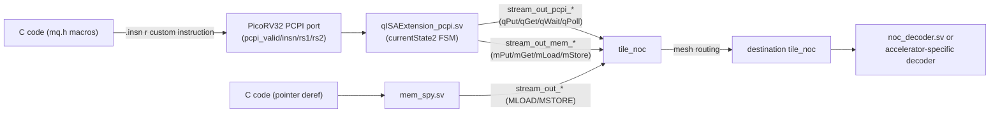

# C Functions

This page documents the C-level API that PicoRV32 firmware uses to talk to the NoC and other tiles, deduced directly from the header files (`mq.h`, `xcustom.h`, `wrapper_mq.h`, `remote_wr.h`) and worked examples in `tools/picorv_c/`. It also explains which HDL signals to watch when confirming packet delivery in a Vivado (or Icarus) waveform.

## Overview: Three Hardware Interfaces

Firmware running on a `pico` tile can reach the rest of the mesh in three distinct ways:

| Interface | How it's invoked from C | HDL entry point |
|---|---|---|
| **Custom RISC-V instructions** (message queue API) | `mq.h` macros: `qPut`, `mPut`, `mGet`, etc. | `qISAExtension_pcpi.sv` (via the PicoRV32 PCPI co-processor port) |
| **Native load/store** | Ordinary pointer dereference (`*ptr = data;`) to a remote address | `mem_spy.sv` (snoops the PicoRV32's native memory bus) |
| **AXI4-Lite control** | Not driven from pico C code — used by a host/testbench or the Vivado IP integrator to configure/read back tile registers | `axi_control.sv` (per-tile `control_S_AXI_*` port) |

Almost all of the example C files in `tools/picorv_c/` use the first interface (the message-queue API). The native load/store path (second row) is used only in `remote_wr.h`'s `wr_mem()`/`rd_mem()` helpers, alongside `mPut`/`mGet`.



## Message Queue API (`mq.h`)

Every macro in `mq.h` expands (via `xcustom.h`'s `PCPI_INSTRUCTION_0_R_R`/`PCPI_INSTRUCTION_R_R_0`) into a single RISC-V custom instruction on the `CUSTOM_1` opcode (`0b0101011`), differentiated by a `func3` field (which operation) and a `func2` field (header/data sub-mode for long packets):

```c
#define qPut(destination_qid, source_data) \
  PCPI_INSTRUCTION_0_R_R(XCUSTOM_MQ, destination_qid, source_data, mq_DO_QPUT, mq_DO_NO);
```
expands to (in `xcustom.h`):
```c
asm volatile(".insn r CUSTOM_1, 3, 0, x0, %0, %1" :: "r"(destination_qid), "r"(source_data));
```

The PicoRV32 core recognizes this as a PCPI (Pico Co-Processor Interface) instruction and hands `rs1`/`rs2` off to `qISAExtension_pcpi.sv`, which decodes `func3` (`pcpi_insn[14:12]`) and `func2` (`pcpi_insn[26:25]`) to pick a branch of its FSM (`currentState2`).

### Queue Primitives (local queue, no address translation)

These target a **queue ID** directly — for `qPut`, the destination tile's coordinate (`{Y[2:0],X[2:0]}`, 6 bits); for `qPoll`/`qGet`/`qWait`, always your own local receive queue (conventionally passed as `0`).

| Function | Signature | What it does | NoC opcode |
|---|---|---|---|
| `qPut(dest_qid, data)` | `void` | Pushes a single-word ("short") packet — header + one data word — to `dest_qid`'s local queue | `QPUT` (`3'd3`) |
| `qPoll(dest_qid, out)` | writes `out` | Non-blocking check: returns `1` if the local queue is empty, otherwise returns the pending message's header | — (local queue read, no NoC traffic) |
| `qGet(dest_qid, out)` | writes `out` | Pops one word from the local queue (used twice in a row to drain a header + data pair — see `w_qGet` below) | — (local queue read) |
| `qWait(dest_qid, out)` | writes `out`, blocks | Blocks (`pcpi_wait`) until the local queue is non-empty, then pops one word | — (local queue read; blocks the pico core) |

Example, from `tools/picorv_c/c_cache/send_msg.c` (the token-ring pattern used across most testcases):
```c
qWait(0, temp);       // block until something arrives in my own queue
w_qGet(0, &ball);      // (wrapper, below) drain header + data word
qPut(dest_tile, ball + 1);  // forward the incremented token to my neighbor
```

### Memory Primitives (remote address, PGAS-style)

These target a full **address** — `remote_tile_id << 12 | offset` (`OFFSET_SZ = 12` bits of per-tile offset) — reaching into a remote tile's memory-mapped space (a scratchpad, the DRAM/cache tile, or an accelerator's register file).

| Function | Signature | What it does | NoC opcode | Blocking? |
|---|---|---|---|---|
| `mPut(source, addr)` | `void` | Non-blocking single-word write to a remote address | `MPUT` (`3'd4`) | No |
| `mGet(remote_addr, local_addr)` | `void` | Non-blocking remote read; result is **forwarded** to `local_addr` (can be a *different* tile — used for tile-to-tile DMA-style transfers, see the [SCF testcase](existing-accelerators/scf)) | `MGET` (`3'd5`) | No |
| `mLoad(out, addr)` | writes `out`, blocks | Blocking remote read; caller stalls until the response (`MDATA`) arrives | `MLOAD` (`3'd6`) | Yes |
| `mStore(addr, data)` | blocks | Blocking remote write; caller stalls until an acknowledgement (`MACK`) arrives | `MSTORE` (`3'd7`) | Yes |

From `remote_wr.h`'s `wr_mem()`/`rd_mem()` (used by `tools/picorv_c/c/pico_scratchpad.c` and `pico_scratchpad_ddr4.c`):
```c
uint32_t remote_mem_address1 = mem_location + (destination_tile_id << 12);
mPut(data1, remote_mem_address1);              // non-blocking write via message queue
*((uint32_t*)((remote_mem_address1 + 90) << 2)) = data2;   // the SAME write, done via a plain STORE instead
```
Both lines write to the same remote tile — the first goes through `qISAExtension_pcpi.sv` (`MPUT`), the second goes through `mem_spy.sv` (`MSTORE`, since a plain store to a non-local address is always treated as *blocking*).

### Long-Packet Primitives

For payloads bigger than one word, split the transaction into a **header** call and one or more **data** calls:

| Function | Role | Opcode + sub-mode |
|---|---|---|
| `qPutH(dest_qid, pktSizeCode)` | Announce a long queue packet | `QPUT` + `PUTH` |
| `qPutD(word1, word2)` | Send 2 payload words (call `2^(pktSizeCode-1)` times) | `QPUT` + `PUTD` |
| `mPutH(dest_addr, pktSizeCode)` | Announce a long memory-write packet | `MPUT` + `PUTH` |
| `mPutD(word1, word2)` | Send 2 payload words | `MPUT` + `PUTD` |
| `mGetH(remote_addr, pktSizeCode)` | Announce a remote-read request, forwarded elsewhere | `MGET` + `PUTH` |
| `mGetD(fwd_addr1, fwd_addr2)` | Complete the forwarding-address beat | `MGET` + `PUTD` |
| `mGetDMA(remote_addr, pktSizeCode)` | DMA-style burst read variant (opcode reserved for a DMA sub-mode; only defined in `c_fp_acc`/`c_fft_acc`/`c_fft_tsqr`'s `mq.h`) | `MGET` + `DMA` |

**Packet size code:** `pktSizeCode = N` means **`2^(N-1)` calls to the corresponding `*D` function**, i.e. `2^N` total 32-bit payload words. This is set directly from `tools/picorv_c/c_long_pkt/long_pkt.c`, which demonstrates every size:
```c
pkt_sz_code = 1;  qPutH(dest_tile, pkt_sz_code); qPutD(data1, data2);                          // 1 call  -> 2 words
pkt_sz_code = 2;  qPutH(dest_tile, pkt_sz_code); qPutD(...); qPutD(...);                        // 2 calls -> 4 words
pkt_sz_code = 3;  qPutH(dest_tile, pkt_sz_code); for (i=0;i<4;i++)  qPutD(...);                 // 4 calls -> 8 words
pkt_sz_code = 4;  qPutH(dest_tile, pkt_sz_code); for (i=0;i<8;i++)  qPutD(...);                 // 8 calls -> 16 words
pkt_sz_code = 5;  qPutH(dest_tile, pkt_sz_code); for (i=0;i<16;i++) qPutD(...);                 // 16 calls -> 32 words
```
Internally, `qISAExtension_pcpi.sv` latches `pkt_size_qput = 1 << (pktSizeCode - 1)` when it sees the `_H` call, decrements it on every `_D` call, and asserts `TLAST` on the NoC stream when it reaches `1` — this is the register to watch in a waveform if a long packet looks truncated or extended (see below).

The [ASA](existing-accelerators/asa) accelerator's `send_msg.c` is a minimal real-world example: `qPutH(dest_tile, 2)` followed by exactly `1 << (2-1) = 2` calls to `qPutD`. The [FFT](existing-accelerators/fft) accelerator's firmware instead uses the memory-mapped form: `mPutH(dest_tile, 6)` followed by 16 calls to `mPutD`, streaming 32 words (16 complex samples) per frame.

## Convenience Wrappers

Several `c_*` directories add small helper functions on top of the raw `mq.h` macros — useful patterns to reuse in your own firmware:

```c
// wrapper_mq.h — reassembles a 2-word (header + data) queue message into one value
void w_qGet(uint32_t dest_qid, uint32_t *data) {
   uint32_t header, temp;
   qGet(dest_qid, header);   // discard the header word
   qGet(dest_qid, temp);     // the actual payload word
   *data = temp;
}

// wrapper_mq.h — splits a byte address into {tile_id, word offset} before mPut
void w2_mPut(uint32_t data, uint32_t addr) {
   uint32_t offset = (addr & 0x00000FFF) >> 2;        // low 12 bits = byte offset -> word offset
   uint32_t tile_id = (addr & 0xFFFFF000) >> 2;        // remaining bits = tile ID, pre-shifted
   mPut(data, offset + tile_id);
}

// remote_wr.h — issue `it` non-blocking remote writes/reads in a loop, with a matching STORE/LOAD each time
uint32_t wr_mem(uint32_t dest_tile, uint32_t local_tile, uint32_t it, uint32_t addr_inc);
uint32_t rd_mem(uint32_t dest_tile, uint32_t local_tile, uint32_t it, uint32_t addr_inc);
```

`w2_mPut_float` is identical to `w2_mPut` but documents that `data` is really a `float` bit pattern — useful for the [FP accelerator](existing-accelerators/fp), where `pico_add3.c` builds 64-bit double operands word-by-word with `mPutD_w()`:
```c
void mPutD_w(double d) {
   uint64_t bits = double2hex(d);              // reinterpret the double as raw bits
   mPutD((uint32_t)bits, (uint32_t)(bits >> 32));  // send low word, high word
}
```

## Address and Queue-ID Encoding

| Primitive family | What you pass | Encoding |
|---|---|---|
| `qPut`/`qGet`/`qWait`/`qPoll`/`qPutH`/`qPutD` | a **queue ID** | Tile coordinate packed as `{Y[2:0], X[2:0]}` (6 bits) — e.g. tile `(1,1)` is queue ID `0b001001 = 9`. **Not** row-major. |
| `mPut`/`mGet`/`mLoad`/`mStore`/`mPutH`/`mPutD`/`mGetH`/`mGetD` | a **remote address** | `(tile_id << 12) | offset` — `OFFSET_SZ = 12` bits of local offset, tile ID in the upper bits (same `{Y,X}` coordinate scheme) |

This is why almost every example computes `addr = tile_id << 12` (or, in `pico_add3.c`, `fp_addr = FP_ADD10 | FP_END | tidh`, an OR-based variant of the same idea) before calling an `m*` function.

## Reading Packet Delivery in Vivado Waveforms

Several signals in the RTL carry a `(*mark_debug = "true"*)` attribute, meaning they are automatically brought out to an ILA core (or are trivially visible in a behavioral-simulation waveform) without any extra instrumentation. Use the table below to trace a message from the moment C code executes to when it lands at the destination.

### 1. At the sender: did the instruction get accepted?

| Signal | Location | What to look for |
|---|---|---|
| `pcpi_valid`, `pcpi_insn`, `pcpi_rs1`, `pcpi_rs2` | `acc_picorv32.sv` | `pcpi_valid` pulses high with `pcpi_insn[6:0] == 0x2B` when a `mq.h` macro executes; `rs1`/`rs2` are its two arguments |
| `pcpi_wr`, `pcpi_rd`, `pcpi_wait`, `pcpi_ready` | `acc_picorv32.sv` | `pcpi_wait` high = the pico core is stalled (this is what `qWait`/`mLoad`/`mStore` look like); `pcpi_ready` pulses when the instruction has been consumed |
| `currentState2` | `qISAExtension_pcpi.sv` | The message-queue FSM state. Key values: `IDLE_S` (0x0) waiting, `QPUT_S`/`QPUT_H0_S`/`QPUT_DATA0_S`/etc. building an outgoing packet, `QWAIT0_S`/`QWAIT1_S` blocked on a local queue, `SEND2_S`/`MDONE_S` sending a memory-family packet |

If `pcpi_valid` never pulses, the compiler didn't emit the custom instruction (check that `mq.h`/`xcustom.h` were actually included and the `.insn r` assembly wasn't optimized away).

### 2. Leaving the tile: did the packet reach the NoC?

| Signal | Location | What to look for |
|---|---|---|
| `stream_out_TVALID/TDATA/TKEEP/TLAST/TREADY` | `acc_picorv32.sv` (tagged `mark_debug`) | The tile's outbound NoC stream. For a short packet, one `TVALID` beat with `TLAST=1`; for a long packet, a beat with `TLAST=0` (header) followed by `2^(pktSizeCode-1)` beats of 2 words each, `TLAST=1` on the last |
| `stream_out_pcpi_*` / `stream_out_mem_*` | `qISAExtension_pcpi.sv` | Split before the two `noc_buffer_out` instances merge onto the tile's local NoC port — `_pcpi` carries `q*` traffic, `_mem` carries `m*` traffic |
| `stream_out_TVALID/TDATA` (mem_spy) | `mem_spy.sv` | Only active for plain pointer LOAD/STORE (not `mq.h` macros) — `currentState4` (`MIO_IDLE`/`MIO_SEND`/`MIO_SEND2`/`MIO_WAIT`) shows the handshake |
| `TDATA[27:25]` on the header beat | any outbound stream | Decode this 3-bit field against the opcode table above (`QPUT=3`, `MPUT=4`, `MGET=5`, `MLOAD=6`, `MSTORE=7`) to confirm the right opcode was sent |

{: .note }
Every accelerator tile documented in [Existing Accelerators](existing-accelerators) has its own `stream_in_TVALID`/`TDATA`/`TKEEP`/`TLAST` ports (some `mark_debug`-tagged, e.g. `Tile_mem_mgr.sv`'s and `Tile_picorv32.sv`'s 4-lane mesh ports) — the generic guidance here applies at every tile boundary in the mesh, not just at a `pico` tile.

### 3. In transit: routing through `tile_noc`

Each tile's `tile_noc` switch has 4 mesh-facing ports (commonly the `mark_debug`-tagged `stream_in_TVALID[3:0]`/`stream_out_TVALID[3:0]` seen on `Tile_picorv32`/`Tile_mem_mgr`) plus a local port to the tile's accelerator. If a packet vanishes between tiles, check the switch's port-to-port muxing by comparing `stream_out_TDATA` on the sending tile's local port against `stream_in_TDATA` on the receiving tile's corresponding mesh-facing port — the header's destination field (`TDATA[23:18]` in most decoders, i.e. `{Y,X}`) tells you which port the switch should have selected.

### 4. At the receiver: did it decode correctly?

| Signal | Location | What to look for |
|---|---|---|
| `currentState1` | `noc_decoder.sv` (generic tiles: scratchpad, etc.) | `IDLE` (0) waiting; `FIFO_WR` draining a `qPut`-style packet into the local receive queue; `MEM_WR`/`MEM_WR_ACK`/`MEM_WR_DAT` handling `MPUT`/`MSTORE`/`MDATA`; `MEM_RD`/`MEM_RD2`/`WAIT_SEND` handling `MGET`/`MLOAD` responses |
| `mem_valid_a`, `mem_addr_a`, `mem_wdata_a`, `mem_wstrb_a` | `noc_decoder.sv` | The decoded memory-bus transaction handed to the tile's local memory/accelerator — confirms the address and data actually extracted from the packet |
| `fifo_0A_en`, `fifo_0A_addr` | `noc_decoder.sv` | Pulses when a `qPut`-style message is being written into the destination's local receive queue (what a subsequent `qGet`/`qWait` will read back) |
| Accelerator-specific decoder state | e.g. `asa_noc_dec`'s `state`, `acc_fft_sw16`'s `state_in`, `dm_cache_fsm`'s FSM | See each accelerator's page under [Existing Accelerators](existing-accelerators) for its exact decode states — the same "watch the FSM state alongside `stream_in_TDATA`" technique applies |
| `unblock` | `noc_decoder.sv` / `mem_spy.sv` | Pulses to release a pico that's stalled on `qWait`, `mLoad`, or `mStore` once its response has arrived |

### Worked Example: Confirming a `qPutH`/`qPutD` Long Packet

Using `tools/picorv_c/c_long_pkt/long_pkt.c`'s `pkt_sz_code = 3` case (`qPutH(9, 3)` then 4x `qPutD`):

1. At the sending tile, watch `currentState2` in `qISAExtension_pcpi.sv` transition through `QPUT_H0_S`/`QPUT_H1_S` (consuming the `qPutH` call) then `QPUT_DATA0_S`/`QPUT_DATA1_S` four times (one per `qPutD` call).
2. On `stream_out_pcpi_TVALID`/`TDATA`, expect: 1 header beat, then 4 beats of 2 words each = 8 payload words, with `TLAST` asserted only on the very last beat.
3. At the receiving tile (queue ID 9, coordinate `(1,1)`), `noc_decoder.sv`'s `currentState1` should move `IDLE -> FIFO_WR`, with `fifo_0A_en` pulsing once per beat (9 times total: 1 header + 8 data) as it fills the local receive queue.
4. A subsequent `qGet`/`qWait` on tile 9 should then read back exactly those 9 words in order.

If the beat count doesn't match, check `pkt_size_qput` in `qISAExtension_pcpi.sv` — a mismatch there (e.g. `pktSizeCode` set wrong, or a `qPutD` call missing/extra) is the most common cause of a truncated or hung transfer.

<div style="display: flex; justify-content: space-between;">
  <a href="{{ '/docs/existing-accelerators/sne' | relative_url }}" class="btn btn-light mr-2"><i class="fa-solid fa-arrow-left-long"></i> Go back</a>
  <a href="{{ '/docs/open-nic-shell' | relative_url }}" class="btn btn-light mr-2"><i class="fa-solid fa-arrow-right-long"></i> Continue</a>
</div>
