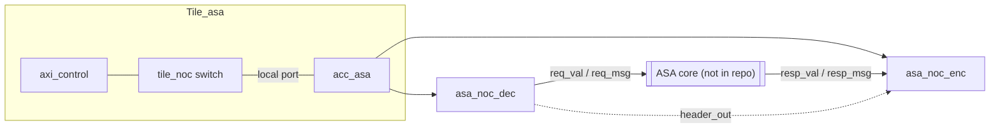

# ASA Accelerator

## Overview

The ASA tile (`src/Tile.HDL/asa_tile/`) integrates a key/data associative accelerator into the MoSAIC mesh. The directory provides all of the **MoSAIC-side glue** needed to talk to an ASA core over the NoC — clock-domain crossing, packet decode/encode, and tile-level wiring — but the ASA compute core itself (the `ASA` module, and the `asa_types` package that defines its message structs) is **not included in this repository**. It is instantiated as a black box in `acc_asa.sv` and must be supplied separately (e.g. generated by another toolchain or supplied by the accelerator's original author).

Because the core itself isn't present, this page documents what is verifiable directly from the source: the tile structure, the NoC packet protocol used to talk to ASA, and the opcodes the decoder recognizes. It does not speculate about what ASA computes internally.

Source files:
- `src/Tile.HDL/asa_tile/Tile_asa.sv`
- `src/Tile.HDL/asa_tile/acc_asa.sv`
- `src/Tile.HDL/asa_tile/asa_noc_dec.sv`
- `src/Tile.HDL/asa_tile/asa_noc_enc.sv`
- Testcase: `tools/generate/mosaic_asa.pl`
- Firmware: `tools/picorv_c/c_asa/send_msg.c`

## Tile Structure



- **`Tile_asa`** — top-level tile wrapper. Registered as tile alias `asa` (mapped to Verilog module `Tile_asa`) by the testcase generator. It instantiates `axi_control` (AXI4-Lite register block shared by all tile types — provides `rvControl` and tile X/Y coordinates), `acc_asa`, and `tile_noc` (the tile's local NoC router). Contains no ASA-specific logic itself.
- **`acc_asa`** — bridges the NoC (running on `clk_line`) to the ASA core (running on `clk_ctrl`):
  1. `noc_buffer_in` crosses the inbound NoC stream from `clk_line` to `clk_ctrl`.
  2. `asa_noc_dec` decodes the packet into an `ASAReqMsg` and simultaneously pre-builds the response header.
  3. The (black-box) `ASA` core consumes `req_val`/`req_msg` and produces `resp_val`/`resp_msg`.
  4. `asa_noc_enc` serializes the response (plus the pre-built header) back onto the NoC.
  5. `noc_buffer_out` crosses the outbound stream back to `clk_line`.

Two items are explicitly flagged in the source as questionable and worth knowing about if you're bringing this tile up on hardware:
- `acc_asa.sv`: `assign stream_in_TREADY_int = req_rdy;  // Kylie says is a bug` — NoC readiness is tied directly to the ASA core's request-ready signal rather than being decoupled/registered.
- `asa_noc_dec.sv`: the reset value for `req_msg.inst` (`ASA_IADD`) is marked `// TODO: not sure what to initialize it to ... ASK: confirm with Patricia`.

## Request Packet Format (software → ASA)

`asa_noc_dec` is a fixed 6-state decoder that expects exactly this beat sequence on the tile's local NoC port:

| State | Beat | Field decoded |
|---|---|---|
| 0 | Header word | Latched into `header_reg`; used to build the response header (destination = `header_reg[23:18]`) |
| 1 | Filler word | Skipped |
| 2 | Opcode word | `stream_in_TDATA[3:0]` → `req_msg.inst` (see opcode table) |
| 3 | Key word | `req_msg.key` (32 bits) |
| 4 | Data-high word | `req_msg.data[63:32]` |
| 5 | Data-low word | `req_msg.data[31:0]`; asserts `req_val` for one cycle |

**Opcode encoding** (`stream_in_TDATA[3:0]` at state 2):

| Bits | Opcode |
|---|---|
| `0000` | `ASA_IADD` |
| `0001` | `ASA_TIAD` |
| `0010` | `ASA_MIAD` |
| `1101` | `ASA_GASU` |
| `1110` | `ASA_ALLO` |
| `1111` | `ASA_GATH` |
| *(other)* | defaults to `ASA_IADD` |

The message format is a 32-bit **key** plus a 64-bit **data** payload per request.

## Response Packet Format (ASA → software)

`asa_noc_enc` streams an 8-beat response (matching the `pkt_sz_code = 3` → 2³ = 8 words declared by the decoder):

| Beat | Content |
|---|---|
| 0 | `resp_msg.addr[63:32]` (header is sent earlier, while waiting for `resp_val`) |
| 1 | `resp_msg.addr[31:0]` |
| 2 | `resp_msg.key[63:32]` |
| 3 | `resp_msg.key[31:0]` |
| 4 | `resp_msg.data[63:32]` |
| 5 | `resp_msg.data[31:0]` (`TKEEP` = `'hFFFF`) |
| 6 | Padding (all zero) |
| 7 | Padding (all zero) |

The response is routed back using the MoSAIC **`QPUT`** opcode (`3'd3`), and destination coordinates are taken directly from the original request's header (`header_reg[23:18]`).

## Testcase: `mosaic_asa.pl`

A minimal 2x2 mesh used to exercise the ASA tile end to end:

```perl
$new_tile{'asa'} = 'Tile_asa';

@tile_array = (['pico', 'loop'],
               ['loop', 'asa']);
```

Only tile `(0,0)` (the `pico`) is given firmware (`send_msg32_0.hex`, compiled from `tools/picorv_c/c_asa/send_msg.c`); the `loop` tiles are simple pass-throughs. Simulation runs for `sim_loop = 20000` cycles, targeting a `u250` board.

## Software Example: `send_msg.c`

```c
int tile_id = atoi(argv[1]);
int dest_tile = 9;          // ASA tile's coordinate-based ID: {Y=1,X=1} -> 0b001001 = 9

qPutH(dest_tile, 2);        // Header, packet-size code 2
qPutD(0x0, 0x19);           // filler + opcode word
qPutD(0xe, 0xf);            // key + data
```

This is a minimal smoke test: it uses the raw `qPutH`/`qPutD` message-queue primitives (see [C Functions](../c-functions)) to hand-construct a 5-word payload matching the decoder's expected beat sequence, and expects a 9-word reply (header + the 8 response beats above).

{: .note }
Note that MoSAIC tile IDs used by `qPut`/`mPut` are **coordinate-based**, not row-major: the ID packs `{Y[2:0], X[2:0]}` into 6 bits, so tile `(1,1)` is ID `0b001001 = 9`, not the row-major index `3`.

<div style="display: flex; justify-content: space-between;">
  <a href="{{ '/docs/existing-accelerators' | relative_url }}" class="btn btn-light mr-2"><i class="fa-solid fa-arrow-left-long"></i> Go back</a>
  <a href="{{ '/docs/existing-accelerators/cache' | relative_url }}" class="btn btn-light mr-2"><i class="fa-solid fa-arrow-right-long"></i> Continue</a>
</div>
