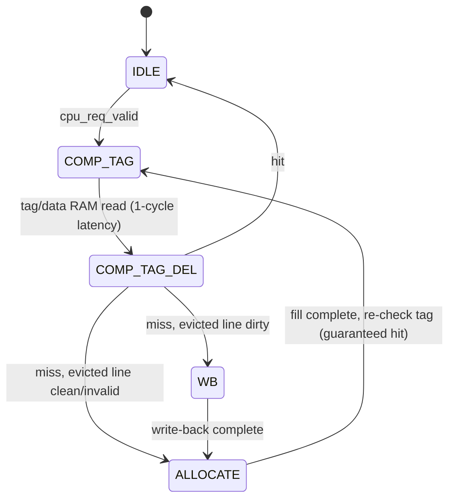

# Cache / DRAM Tile

## Overview

The "Cache" tile (referred to as the DRAM tile or **tile memory manager** in the source) gives the mesh access to shared, cached DRAM. Any tile can issue a remote memory request (`mPut`/`mGet`/`mLoad`/`mStore`) targeting this tile's coordinates, and the tile serves it as a **direct-mapped, write-back, write-allocate cache** backed by an AXI4 DRAM controller.

Source files:
- `src/Tile.HDL/dram_tile/Tile_mem_mgr.sv` — tile-level wrapper
- `src/Tile.HDL/dram_tile/acc_mem_mgr.sv` — memory-manager integration core
- `src/Tile.HDL/dram_tile/mem_mgr_noc_decoder.sv` — NoC request decoder
- `src/Tile.HDL/dram_tile/mem_mgr_noc_encoder.sv` — NoC response encoder
- `src/Tile.HDL/dram_tile/mem_mgr_axi.sv` — AXI4 burst generator to the DRAM controller
- `src/Tile.HDL/cache_ctrl/dm_cache_fsm.sv` — cache controller FSM
- `src/Tile.HDL/cache_ctrl/dm_cache_tag.sv` — tag store
- `src/Tile.HDL/cache_ctrl/dm_cache_data.sv` — data array
- Testcase: `tools/generate/mosaic_cache.pl`
- Firmware: `tools/picorv_c/c_cache/send_msg.c`

## Cache Organization

`dm_cache_fsm.sv` is explicitly modeled after the cache controller FSM in Patterson & Hennessy's *Computer Organization and Design* (Section 5.9), and confirms a **direct-mapped, write-back, write-allocate** policy:

| Property | Value |
|---|---|
| Associativity | Direct-mapped (1 way per set) |
| Line size | 512 bits = 64 bytes |
| Default line count | 8 (set via `ddr_cache_lines` in the testcase → `` `CACHE_LINES `` macro) |
| Default total capacity | 512 bytes (8 lines x 64 bytes) |
| Write policy | Write-back (dirty lines only flushed on eviction) |
| Allocation policy | Write-allocate (a write miss fetches the line before writing) |
| Tag width (8 lines) | 23 bits (32 - 3 index bits - 6 byte-offset bits) |



- **`IDLE`** — latch the incoming CPU-side request (address/data/rw).
- **`COMP_TAG`** — issue the tag/data RAM read for the address's index.
- **`COMP_TAG_DEL`** — (accounts for the RAM's 1-cycle read latency) compare the stored tag against the request's tag.
  - **Hit:** respond immediately; if it's a write, update the data array and mark the line dirty.
  - **Miss:** allocate a new tag entry immediately; if the evicted line was valid and dirty, write it back first (`WB`), otherwise skip straight to `ALLOCATE`.
- **`WB`** — write the dirty evicted line back to DRAM, then issue a read for the new line.
- **`ALLOCATE`** — wait for the fill data from DRAM, write it into the data array, then redo `COMP_TAG` (now a guaranteed hit).

Byte/word selection within a line is done with `cpu_req_addr[5:2]` (4 bits selecting one of 16 32-bit words in the 64-byte line).

`dm_cache_tag.sv` stores the tag bits in a small `xpm_memory_spram` block, while the valid/dirty bits are kept as plain flip-flop arrays (bit-level updates, rather than block-RAM granularity).

## NoC Memory Protocol

Unlike the queue-based `qPut`/`qGet` primitives, the memory-manager protocol addresses this tile directly via `mPut`/`mGet`/`mLoad`/`mStore`, decoded from bits `[27:25]` of the packet header:

| Opcode | Value | Meaning |
|---|---|---|
| `MPUT` | `3'd4` | Remote write, fire-and-forget (no response) |
| `MGET` | `3'd5` | Remote read, non-blocking (response delivered as an `MPUT` back to requester) |
| `MLOAD` | `3'd6` | Remote read, blocking (requester waits for `MDATA` response) |
| `MSTORE` | `3'd7` | Remote write, blocking (requester waits for `MACK` response) |
| `MACK` | `3'd1` | Response to `MSTORE` |
| `MDATA` | `3'd2` | Response to `MLOAD` |

`mem_mgr_noc_decoder.sv` supports both:
- **Short packets** (`header[28]==0`): a single inline word, address built from `{header[5:0], noc_offset}`.
- **Long packets** (`header[28]==1`): a full 32-bit address plus a power-of-two burst length (`1 << header[11:8]` for puts/stores, `1 << header[15:12]` for gets/loads), streamed word-by-word until `TLAST`.

`mem_mgr_noc_encoder.sv` builds the matching response (`MACK` for `MSTORE`, `MDATA` for `MLOAD`, `MPUT` for `MGET`; no response for `MPUT`), routed back to the coordinates embedded in the original request header.

`mem_mgr_axi.sv` converts each cache-line-sized request into a single AXI4 burst of length 1 (`awsize='h6` = 64 bytes/beat), so every DRAM transaction is exactly one cache line.

{: .note }
`acc_mem_mgr.sv` also exposes a secondary "fast AXI passthrough" side-channel (gated by `rvControl[0]==0`), intended for a host/NIC front-end to poke individual reads into the cache outside the normal NoC path. It is explicitly marked `/*Temporal MacGyver*/` in the source — treat it as a stop-gap mechanism, not the primary interface.

## Testcase: `mosaic_cache.pl`

A 4x4 mesh (16 tiles) with DDR4/cache support enabled:

```perl
$param{'r'} = 4;
$param{'c'} = 4;
# ... generic_tile_array() fills the grid with 'pico' tiles ...
$tile_array[0][1] = 'spad';   # one scratchpad tile
$pico_program[1]  = 'nop.hex';

$param{'ddr4_flag'}       = 1;   # add the tile memory manager
$param{'ddr_cache_lines'} = 8;   # 8 lines x 64 bytes = 512-byte cache
$param{'ddr_init_file'}   = 'send_msg_0_inst.hex';
$param{'vivado_ip_dram'}  = 1;   # instantiate the real Xilinx DDR4 IP
```

## Software Example: `send_msg.c`

Every `pico` tile runs the same firmware and participates in a token-passing ring (skipping the scratchpad tile), then each tile independently stress-tests the cache with a burst of `mPut` writes:

```c
uint32_t end_exec[192] __attribute__ ((section(".myspad")));

// Token seed (first tile only)
qPut(0, 5);

// Every tile:
qWait(0, temp);
w_qGet(0, &ball);
qPut(dest_tile, ball + 1);          // pass the token to the next tile in the ring

// Debug/stress-test writes into the shared cached DRAM:
uint32_t addr = (uint32_t)&end_exec[tile_id*20] >> 2;
mPut(0xf0ca0000 | tile_id, addr++);   // this tile's signature
mPut(0xcafe0000 | ball,    addr++);   // the token value it received
for (int i = 0; i < 18; i++) {
    mPut(0xbeef0000 | dest_tile, addr++);  // filler/stress pattern
}
```

With 16 tiles each performing 20 `mPut` writes, this generates 320 individual memory-write transactions spread across an address range much larger than the 8-line cache, exercising both cache hits and write-back evictions.

<div style="display: flex; justify-content: space-between;">
  <a href="{{ '/docs/existing-accelerators/asa' | relative_url }}" class="btn btn-light mr-2"><i class="fa-solid fa-arrow-left-long"></i> Go back</a>
  <a href="{{ '/docs/existing-accelerators/fft' | relative_url }}" class="btn btn-light mr-2"><i class="fa-solid fa-arrow-right-long"></i> Continue</a>
</div>
