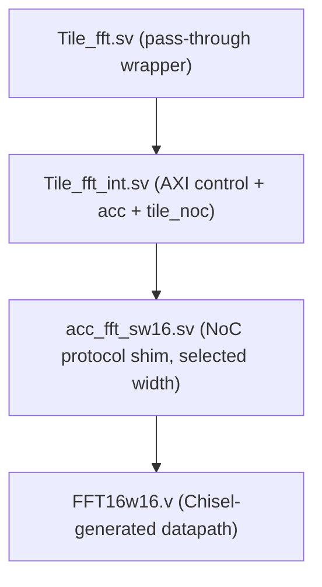
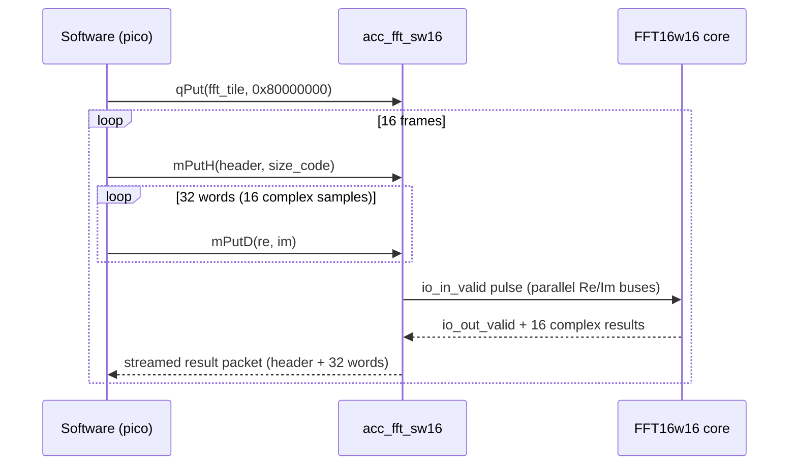

# FFT Accelerator

## Overview

The FFT tile wraps a **Chisel-generated, fully-parallel, single-precision floating-point FFT pipeline** in a hand-written NoC decoder/encoder shim, so it can receive input samples and return transformed output over the MoSAIC NoC. The design has three layers:



Source files:
- `src/Tile.HDL/fft_tile/Tile_fft.sv` — top-level tile wrapper
- `src/Tile.HDL/fft_tile/Tile_fft_int.sv` — internal glue (AXI control + accelerator + NoC switch)
- `src/Tile.HDL/fft_tile/acc_fft_sw{2,4,8,16,32}.sv` — NoC protocol shim, one per streaming width
- `src/Tile.HDL/fft_tile/FFT{N}w{W}.v` — Chisel-generated pipelined FFT cores (multiple N/W combinations provided)
- Testcase: `tools/generate/mosaic_fft.pl`
- Firmware: `tools/picorv_c/c_fft_acc/send_msg.c`

## Selecting an FFT Size and Streaming Width

Per `src/Tile.HDL/fft_tile/README.md`, two independent choices configure the accelerator:

1. **Streaming width** is chosen in `Tile_fft_int.sv` by picking which `acc_fft_sw{2,4,8,16,32}` module is instantiated.
2. **FFT size (N)** is chosen inside that `acc_fft_sw*.sv` file, by picking which generated `FFT{N}w{W}` module it instantiates internally.

Generated cores shipped in the repo (name format `FFT{size}w{streaming width}`):

| N \ W | 2 | 4 | 8 | 16 | 32 |
|---|---|---|---|---|---|
| 4  | FFT4w2 | FFT4w4 | - | - | - |
| 8  | FFT8w2 | FFT8w4 | FFT8w8 | - | - |
| 16 | FFT16w2 | FFT16w4 | FFT16w8 | FFT16w16 | - |
| 32 | FFT32w2 | FFT32w4 | FFT32w8 | FFT32w16 | FFT32w32 |

The shipped high-width configurations pair N=W (e.g. `FFT16w16`, `FFT32w32`), meaning **all N samples arrive and transform in parallel in one shot** — there's no time-multiplexed folding at those widths. Lower-width variants (`FFT16w2`, `FFT32w8`, etc.) exist for cases where you want a narrower NoC-facing streaming interface than the full transform size.

The FFT core itself (e.g. `FFT16w16`) also supports **inverse FFT** via its `io_in_inv` input, though the current `acc_fft_sw*.sv` shims tie this permanently to `0` (forward transform only).

## `acc_fft_sw16` — NoC Protocol Shim (representative)

Each `acc_fft_sw*` module (all structurally identical, differing only in `FFT_streamingwidth` and the specific generated core instantiated) implements a **NoC packet decoder -> FFT core -> NoC packet encoder** pipeline:



**Input decode FSM (`state_in`):**
- State 0: waits for a valid beat; distinguishes a **short packet** (`TDATA[28]==0`, e.g. the `0x80000000` enable command) from a **long packet** (data payload, requires `in_fft_en` already set).
- State 1: captures the second header word; decodes bits `[9:8]` to decide return routing (`01` = forward via `MPUT`, `10` = final send to the host pico via `QPUT`, else default `MPUT` back to tile 0); builds the outgoing response header.
- States 2-33: shift 32 sequential 32-bit NoC words into a `64*FFT_streamingwidth`-bit register (16 complex Re/Im samples for width 16), placing each word into the exact bit range the generated FFT core expects.
- State 33: asserts `in_valid` to fire the FFT core; loops back to state 0 on `TLAST`.
- State 35: handles the short-packet enable command (`0x80000000`), toggling `in_fft_en`.

**Output encode FSM (`state_out`)** drains a header FIFO and a result FIFO (both Xilinx `xpm_fifo_sync`), streaming the transformed samples back out word-by-word and asserting `TLAST` on the final word.

Local opcode constants match the software-side `mq.h` macros exactly: `QPUT = 3'd3`, `MPUT = 3'd4`.

## `FFT16w16` — Generated Datapath

The generated core (Chisel/FIRRTL output, ~10,700 lines) exposes a simple valid/ready handshake rather than full AXI-Stream:

```verilog
module FFT16w16(
  input         clock,
  input         reset,
  input         io_in_inv,      // 1 = inverse FFT, 0 = forward
  input         io_in_ready,
  input  [31:0] io_in_0_Re, io_in_0_Im,   // ... through io_in_15_Re/Im
  input         io_in_valid,
  output        io_out_valid,
  output [31:0] io_out_0_Re, io_out_0_Im, // ... through io_out_15_Re/Im
  output        io_out_ready
);
```

Internally it implements a radix-2, pipelined butterfly network using single-precision IEEE-754 floating-point adders/multipliers, with twiddle-factor ROMs specific to the chosen N. Because N and the streaming width are baked into the generated Verilog (not SystemVerilog `parameter`s), changing FFT size means generating a different `FFT{N}w{W}.v` file and swapping the instantiated module name inside the corresponding `acc_fft_sw*.sv` file — it cannot be changed at synthesis/elaboration time within the existing files.

## Testcase: `mosaic_fft.pl`

A 2x2 mesh:

```perl
$new_tile{'fft'} = 'Tile_fft';

@tile_array = (['pico', 'loop'],
               ['loop', 'fft']);
```

`sim_loop = 8000`, targeting a `u250` board.

## Software Example: `send_msg.c` (`tools/picorv_c/c_fft_acc/`)

```c
#define N 16

qPut(9, 0x80000000);           // enable the FFT accelerator (tile 9 = coordinate (1,1))

for (int j = 0; j < N; j++) {
    mPutH(dest_tile, 6);            // header: announce a long packet
    for (int i = 0; i < 32; i++) {
        mPutD(data2, data1);        // 32 words = 16 complex (Re, Im) samples
        data2 = data2 + 1;
    }
}
```

This enables the accelerator with the magic `0x80000000` value, then streams 16 frames of 16-complex-sample test data (a simple incrementing ramp pattern), matching exactly the 32-word input sequence the decode FSM expects per frame.

<div style="display: flex; justify-content: space-between;">
  <a href="{{ '/docs/existing-accelerators/cache' | relative_url }}" class="btn btn-light mr-2"><i class="fa-solid fa-arrow-left-long"></i> Go back</a>
  <a href="{{ '/docs/existing-accelerators/fp' | relative_url }}" class="btn btn-light mr-2"><i class="fa-solid fa-arrow-right-long"></i> Continue</a>
</div>
