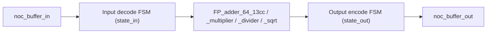

# FP Accelerator

## Overview

The FP tile family provides four double-precision (64-bit IEEE-754-style) floating-point units — **adder, multiplier, divider, and square root** — each wrapped as its own MoSAIC tile type sharing a single generic implementation (`acc_fp.sv`) parameterized by `TYPE`.

Source files:
- `src/Tile.HDL/fp_tile/Tile_fp.sv` — generic tile wrapper, parameterized by `TYPE`
- `src/Tile.HDL/fp_tile/Tile_fp_adder.sv`, `Tile_fp_divider.sv`, `Tile_fp_multiplier.sv`, `Tile_fp_sqrt.sv` — thin wrappers instantiating `Tile_fp` with a fixed `TYPE`
- `src/Tile.HDL/fp_tile/acc_fp.sv` — the shared accelerator core
- `src/Tile.HDL/fp_tile/FP_adder_64_13cc.v`, `FP_multiplier_64_10cc.v`, `FP_divider_64_63cc.v`, `FP_sqrt_64_53cc.v` — Chisel-generated pipelined FP units
- Testcase: `tools/generate/mosaic_fp.pl`
- Firmware: `pico_add5` (see `tools/picorv_c/c_fp_acc/`)

## Available Tile Types

| `TYPE` | Wrapper module | Compute unit | Latency |
|---|---|---|---|
| `"ADDER"` | `Tile_fp_adder` | `FP_adder_64_13cc` | 13 cycles |
| `"MULT"`  | `Tile_fp_multiplier` | `FP_multiplier_64_10cc` | 10 cycles |
| `"DIV"`   | `Tile_fp_divider` | `FP_divider_64` (from `FP_divider_64_63cc.v`) | ~63 cycles |
| `"SQRT"`  | `Tile_fp_sqrt` | `FP_sqrt_64` (from `FP_sqrt_64_53cc.v`) | ~53 cycles |

All four compute units share the same simple handshake:

```verilog
module FP_adder_64_13cc(
  input         clock,
  input         reset,
  input         in_valid,
  input  [63:0] in_data_0,
  input  [63:0] in_data_1,   // sqrt uses a single in_data instead
  output [63:0] out_data,
  output        out_ready    // pulses once when out_data is valid
);
```

## `acc_fp` — NoC Protocol Shim

`acc_fp` is a **decoder FSM -> selected FP unit -> encoder FSM** pipeline, structurally the same pattern used by the FFT and TSQR accelerators:



**Input decode FSM (`state_in`, states 0-6):**
- State 0: latches the first header flit.
- State 1: consumes the second header flit; bits `[9:8]` select the return-routing mode (`01` = forward via `MPUT`, `10` = final send to a pico via `QPUT`, else default `QPUT` back to the sender). Skips directly to operand collection for `TYPE=="SQRT"` (single operand) or proceeds normally for two-operand ops.
- States 2-4: latch the two 64-bit operands (`in_data_0`, `in_data_1`).
- State 5: asserts `in_valid` to the FP unit; loops back for another operation if more data follows in the same packet (state 6), otherwise returns to state 0 on `TLAST`.

This means **a single NoC packet can carry several back-to-back operand pairs**, processed one after another by the same FP pipeline.

**Output encode FSM (`state_out`)** drains a header FIFO and a 64-bit result FIFO (both `xpm_fifo_sync`), re-serializing each 64-bit result as two 32-bit NoC words and asserting `TLAST` on the final word of the packet.

Opcode constants match the software-side `mq.h` macros: `QPUT = 3'd3`, `MPUT = 3'd4`.

{: .note }
The `mem_valid_axi`/`mem_addr_axi`/`mem_wdata_axi`/`mem_wstrb_axi`/`mem_rdata_axi` ports on `acc_fp` are wired in from `axi_control` but not consumed anywhere in the module body — they are currently unused/vestigial.

## Testcase: `mosaic_fp.pl`

An 8x8 mesh with all four FP tile types placed in a column, plus two scratchpads:

```perl
$new_tile{'fp_add'} = 'Tile_fp_adder';
$new_tile{'fp_mul'} = 'Tile_fp_multiplier';
$new_tile{'fp_div'} = 'Tile_fp_divider';
$new_tile{'fp_sqr'} = 'Tile_fp_sqrt';

# 8x8 grid, generic_tile_array() fills it with 'pico', then:
$tile_array[0][1] = 'spad';    $pico_program[1] = 'nop.hex';
$tile_array[1][1] = 'fp_mul';
$tile_array[2][1] = 'fp_add';
$tile_array[3][1] = 'fp_div';
$tile_array[4][1] = 'fp_sqr';
$tile_array[2][2] = 'spad';    $pico_program[...] = 'nop.hex';
```

Firmware `pico_add5` runs on the driving pico tile; `check_fp_adder.sh` validates results after simulation. Because the FP tiles need extra buffering, this testcase widens the NoC buffer depth (`noc_buffer_addr_w = 11`, vs. the default 8).

<div style="display: flex; justify-content: space-between;">
  <a href="{{ '/docs/existing-accelerators/fft' | relative_url }}" class="btn btn-light mr-2"><i class="fa-solid fa-arrow-left-long"></i> Go back</a>
  <a href="{{ '/docs/existing-accelerators/tsqr' | relative_url }}" class="btn btn-light mr-2"><i class="fa-solid fa-arrow-right-long"></i> Continue</a>
</div>
