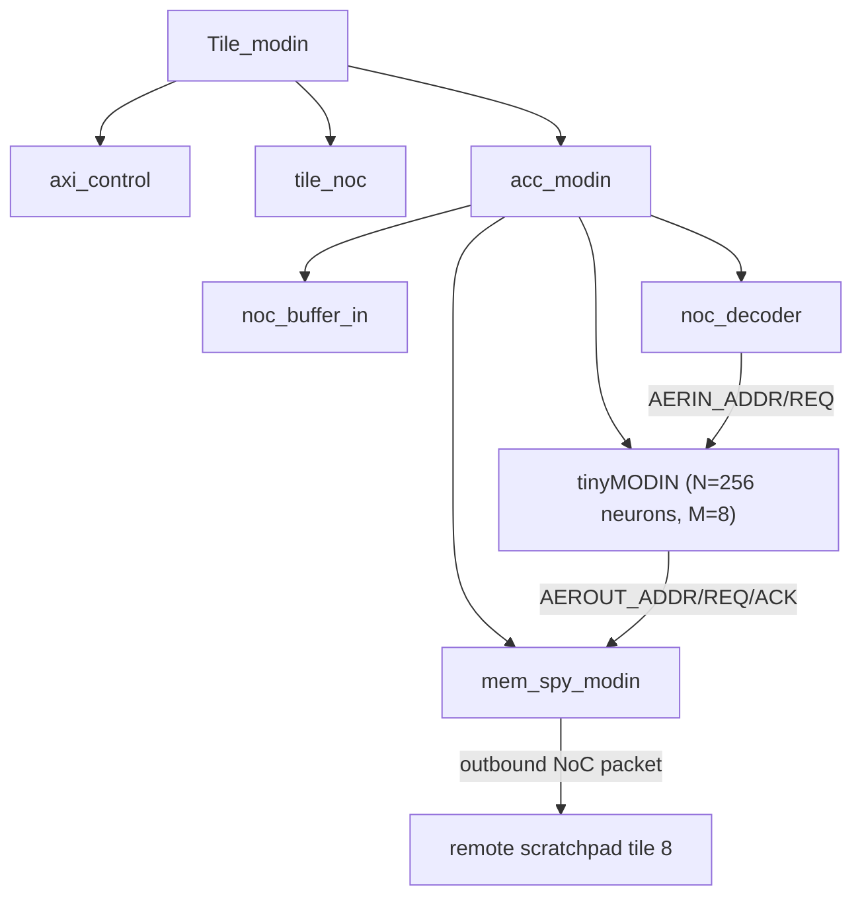

# MoDIN Accelerator

{: .important }
MoDIN lives on the **`modin` branch** of `MoSAIC-P38`, not on `main`. If you want to build or simulate it, check out that branch first: `git checkout modin` (or `git fetch && git checkout -b modin origin/modin`).

## Overview

**MoDIN = MoSAIC + ODIN.** It integrates [tinyODIN](https://github.com/ChFrenkel/ODIN) — an open-source digital spiking neuromorphic processor (256 neurons, 64k synapses) originally developed by C. Frenkel et al. (UCLouvain, TU Delft, KU Leuven, UZH) — as a MoSAIC tile, replacing tinyODIN's original SPI configuration interface with MoSAIC's AXI/NoC-based message-passing fabric.

> C. Frenkel, M. Lefebvre, J.-D. Legat and D. Bol, "A 0.086-mm² 12.7-pJ/SOP 64k-Synapse 256-Neuron Online-Learning Digital Spiking Neuromorphic Processor in 28-nm CMOS," *IEEE Trans. Biomedical Circuits and Systems*, vol. 13, no. 1, pp. 145-158, 2019.

Source files (on the `modin` branch):
- `src/Tile.HDL/modin_tile/Tile_modin.sv` — top-level tile wrapper
- `src/Tile.HDL/modin_tile/acc_modin.sv` — NoC/AER bridge
- `src/Tile.HDL/modin_tile/tinyMODIN.v` — adapted tinyODIN core (renamed `tinyODIN.v` → `tinyMODIN.v`)
- `src/Tile.HDL/modin_tile/mem_spy_modin.sv` — packages output spikes into outbound NoC packets
- Supporting tinyODIN sub-blocks, largely unmodified: `aer_out.v`, `controller.v`, `fifo.v`, `lif_neuron.v`, `neuron_core.v`, `scheduler.v`, `synaptic_core.v`
- Testcase: `tools/generate/mosaic_modin.pl`
- Firmware: `tools/picorv_c/c_modin/pico_snn.c`
- `doc/MoDIN Project Tutorial & Report.pdf` (on the `modin` branch) is the authoritative write-up for this integration.

## Tile Structure



`Tile_modin` follows the same tile-wrapper pattern as the other accelerators (`axi_control` + `tile_noc` + accelerator core). `acc_modin` is the MoDIN-specific bridge:

- **Inbound (software → MoDIN):** a `noc_decoder` parses NoC packets addressed to this tile; a write to the tile's address directly pulses `AERIN_REQ` with `AERIN_ADDR` set from the low 10 bits of the write data — i.e., an ordinary NoC memory write becomes an AER ("Address-Event Representation") spike-input event.
- **Outbound (MoDIN → software):** every time a neuron fires, `tinyMODIN`'s AER-out handshake (`AEROUT_ADDR`/`AEROUT_REQ`/`AEROUT_ACK`) is picked up by `mem_spy_modin`, which packages it as an outbound NoC write to a **hardcoded** destination — tile 8's scratchpad, at an auto-incrementing address (wrapping after 4096 entries). This is fire-and-forget spike logging, not a general-purpose destination-programmable send.
- **Configuration:** `control_S_AXI_*` (via `axi_control`) is wired straight into `tinyMODIN`'s `mem_valid_axi`/`mem_addr_axi`/`mem_wdata_axi`/`mem_wstrb_axi`/`mem_rdata_axi` ports, which is the `ODIN_MOSAIC_CTRL` block's config/readback register bus — this replaces tinyODIN's original SPI interface (`ODIN_SPI_CTRL` → `ODIN_MOSAIC_CTRL`), and is presumably how synapse weights, neuron parameters, and mode bits (gate-activity, open-loop) are programmed.

## `tinyMODIN` — Adapted tinyODIN Core

```verilog
module tinyMODIN(
  CLK, RST,
  mem_valid_axi, mem_addr_axi, mem_wdata_axi, mem_wstrb_axi, mem_rdata_axi, rvControl,
  AERIN_ADDR, AERIN_REQ, AERIN_ACK,
  AEROUT_ADDR, AEROUT_REQ, AEROUT_ACK,
  SCHED_FULL
);
parameter N = 256;   // number of neurons
parameter M = 8;     // log2(N)
```

Internally it is the original tinyODIN architecture, essentially unmodified apart from the SPI-to-AXI adaptation:
- **`ODIN_MOSAIC_CTRL`** (renamed from `ODIN_SPI_CTRL`) — decodes the AXI-bridged config bus into programming/readback events for the synaptic array and neuron memory.
- **`controller`** — the central FSM; consumes spike-input events (`AERIN_*`) and programming events, drives the synaptic array, neuron memory, neuron datapath, and event scheduler.
- **`scheduler`** — the event-driven "virtual time" queue central to ODIN's architecture; supports both open-loop (externally driven spike stream) and closed-loop (self-sustaining network activity) operation.
- **`synaptic_core`** — the 64k-synapse weight memory array.
- **`neuron_core`** — the leaky-integrate-and-fire (LIF) neuron array; produces `NEUR_EVENT_OUT` (spike fired) fed back into the scheduler and AER-out path.

## Testcase: `mosaic_modin.pl`

A 2x2 mesh:

```perl
$new_tile{'modin'} = 'Tile_modin';

@tile_array = (['pico', 'spad'],
               ['spad', 'modin']);

@pico_program = ('pico_snn32_0.hex', '', '', 'hex_files/SPI_file_closedLoopOnly.hex');
```

The `modin` tile is preloaded with a hex image (`SPI_file_closedLoopOnly.hex`) that initializes it for a closed-loop test scenario (commented-out alternatives in the script show open-loop phase files were also tested). `sim_loop = 100000` cycles, targeting Vivado simulation.

## Software Example: `pico_snn.c`

Described in its own header comment as a recreation of tinyODIN's original `tbench.sv` stimulus sequence, ported to drive MoDIN over the NoC instead of a direct SPI/AER testbench:

```c
int addr = 9;
addr = addr << 12;              // MoDIN tile's NoC address (tile 9, OFFSET_SZ=12)

// Closed-loop test (enabled by default):
mPut(0x253, addr);               // "Virtual value 5 event to neuron 3"
mPut(0x253, addr);
```

A disabled open-loop code path in the same file shows a more elaborate stimulus: it sends a flush/priming sequence (`0x1FF` repeated 2050 times), then 160 spike events cycling through a fixed neuron-address test pattern, then 100 "virtual"/broadcast events, then 300 events sustained on a single neuron — reproducing the original tinyODIN testbench's stimulus phases in software.

{: .note }
Commit history on the `modin` branch shows this integration was actively debugged (fixing a broken controller state machine, fixing a broken scratchpad address counter) before the commit message "Closed Loop tests work correctly" — the closed-loop path is the most mature/verified configuration; open-loop is present but disabled by default.

<div style="display: flex; justify-content: space-between;">
  <a href="{{ '/docs/existing-accelerators/tsqr' | relative_url }}" class="btn btn-light mr-2"><i class="fa-solid fa-arrow-left-long"></i> Go back</a>
  <a href="{{ '/docs/existing-accelerators/scf' | relative_url }}" class="btn btn-light mr-2"><i class="fa-solid fa-arrow-right-long"></i> Continue</a>
</div>
