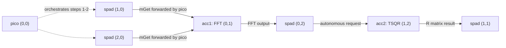

# SCF: FFT + TSQR Testcase

{: .note }
"SCF" is not a standalone accelerator — it is the name of the testcase (`tools/generate/mosaic_scf.pl`) that combines the [FFT](../fft) and [TSQR](../tsqr) accelerators in a single MoSAIC mesh. This page walks through that combined configuration.

## Tile Layout

A 3x3 mesh, registering the FFT tile as `acc1` and the TSQR tile as `acc2`:

```perl
$new_tile{'acc1'} = 'Tile_fft';
$new_tile{'acc2'} = 'Tile_tsqr';

$param{'r'} = 3;
$param{'c'} = 3;

@tile_array = (['pico', 'acc1', 'spad'],
               ['spad', 'spad', 'acc2'],
               ['spad', 'spad', 'spad']);
```

| | Col 0 | Col 1 | Col 2 |
|---|---|---|---|
| Row 0 | `pico` (driver) | `acc1` = FFT | `spad` |
| Row 1 | `spad` | `spad` | `acc2` = TSQR |
| Row 2 | `spad` | `spad` | `spad` |

`@pico_program` preloads two of the scratchpads with input data files (`mosaic_scf_input_1.hex` at `(1,0)`, `mosaic_scf_input_2.hex` at `(2,0)`), rather than having the pico generate them.

## Data Flow



1. The pico at `(0,0)` uses `mGet`'s dual-address (source + forward-destination) form to pull data out of the two preloaded scratchpads and route it **directly into the FFT tile** — the pico's own registers never see the data.
2. The FFT tile computes the transform and forwards its output to the scratchpad at `(0,2)`.
3. The TSQR tile at `(1,2)` autonomously requests data from that scratchpad (its own `RequestData` FSM states, no software involvement) and ingests it.
4. TSQR computes the QR decomposition and streams the R-matrix result to the scratchpad at `(1,1)`.

## Software: `send_msg.c` (`tools/picorv_c/c_fft_tsqr/`)

```c
#define N 1024

int inp_spad_1 = 1 << 12;   // scratchpad tile (1,0)
int inp_spad_2 = 2 << 12;   // scratchpad tile (2,0)

qPut(8,  0x80000000);   // enable/kick the first scratchpad's target
qPut(17, 0x80000000);   // enable/kick the second

int inp_offst = 0;
for (int j = 0; j < 512; j++) {
    mGetH(inp_spad_1 + inp_offst, 3);   // request 8-word burst from scratchpad 1
    mGetD(8 << 12, 0);                  // ...forward result directly to the FFT tile
    inp_offst += 8;
}
inp_offst = 0;
for (int j = 0; j < 512; j++) {
    mGetH(inp_spad_2 + inp_offst, 3);   // request 8-word burst from scratchpad 2
    mGetD(8 << 12, 0);                  // ...forward result directly to the FFT tile
    inp_offst += 8;
}
```

The `mGetH`/`mGetD` pair issues a remote read whose result is **forwarded** to a second destination address (here, the FFT tile at `8 << 12`) rather than returned to the requesting pico — a remote-DMA-style transfer. Across both loops, 8192 words (4096 per scratchpad) are moved from the two preloaded scratchpads into the FFT tile without the pico ever touching the data directly.

<div style="display: flex; justify-content: space-between;">
  <a href="{{ '/docs/existing-accelerators/modin' | relative_url }}" class="btn btn-light mr-2"><i class="fa-solid fa-arrow-left-long"></i> Go back</a>
  <a href="{{ '/docs/existing-accelerators/sweep' | relative_url }}" class="btn btn-light mr-2"><i class="fa-solid fa-arrow-right-long"></i> Continue</a>
</div>
