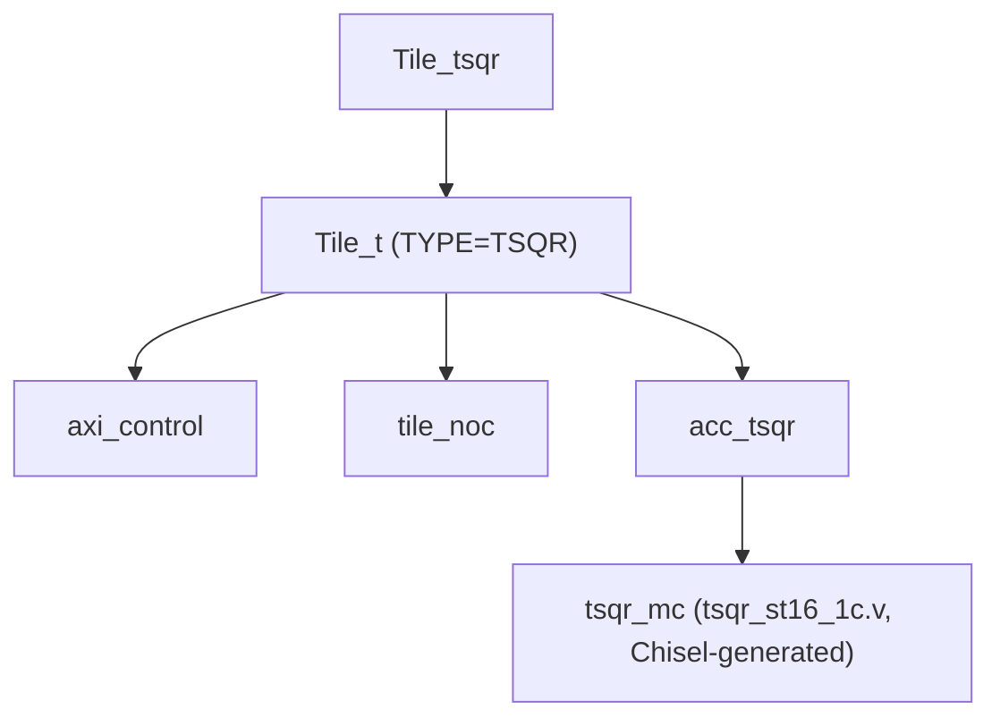
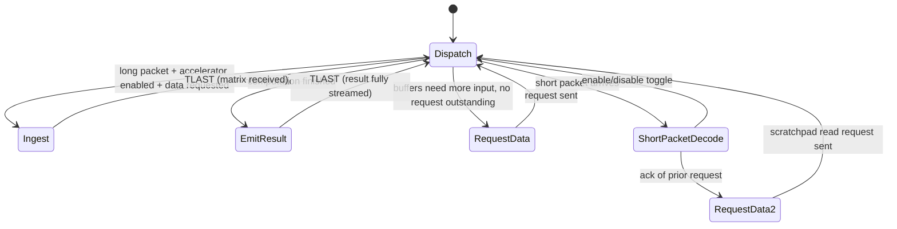

# TSQR Accelerator

## Overview

TSQR ("Tall-Skinny QR") is an accelerator that computes the **QR decomposition of a tall, skinny matrix** using Householder reflections, entirely in hardware. It is typically paired with the [FFT accelerator](../fft) in the combined `scf` testcase (see [SCF: FFT + TSQR Testcase](../scf)), where the FFT tile's output feeds the TSQR tile's input.

Source files:
- `src/Tile.HDL/tsqr_tile/Tile_tsqr.sv` — top-level tile wrapper
- `src/Tile.HDL/tsqr_tile/Tile_t.sv` — generic tile shell (shared pattern with `Tile_fp`)
- `src/Tile.HDL/tsqr_tile/acc_tsqr.sv` — NoC protocol adapter around the compute core
- `src/Tile.HDL/tsqr_tile/tsqr_st16_1c.v` — Chisel-generated Householder-QR datapath
- Testcase: `tools/generate/mosaic_scf.pl`

## Tile Structure



`Tile_tsqr` is a pass-through wrapper around the generic `Tile_t` shell (the same shell pattern used by the FP tiles), which instantiates `axi_control`, `tile_noc`, and the TSQR-specific `acc_tsqr` core.

## `acc_tsqr` — NoC Protocol Adapter

Unlike `acc_fp`/`acc_fft_sw*` (which split ingest and emit into two separate FSMs), `acc_tsqr` uses a **single combined FSM** (`state_in`, 15 states) because TSQR needs to interleave control/request/response traffic rather than following a strict decode-compute-encode pipeline. It manually constructs and parses raw MoSAIC NoC packets bit-by-bit (no generic queue abstraction).



- **Dispatch (state 0):** decides what to do next based on packet type and internal flags (`in_tsqr_en`, `out_tsqr_fi_reg`, `pkt_requested`, `matrix_count`).
- **Ingest (states 1-2):** streams an incoming 256-bit-wide matrix block (8 x 32-bit words per line) into one of two double-buffered internal memories (`dmx0`/`dmx1`, selected round-robin), tracked by `input_pkt_cnt`/`matrix_count`. On `TLAST`, once at least 2 matrix blocks are buffered, asserts `tsqr_en` to kick off the compute core.
- **RequestData (states 3-4):** emits a short 2-beat NoC packet asking the FFT tile for the next chunk of data.
- **EmitResult (states 5-9):** once `tsqr_fi` (finished) is asserted by the compute core, streams the 8x8 = 64-word result (R matrix) out of the `rtri` memory bank to a destination scratchpad tile.
- **ShortPacketDecode (state 10):** `0x80000000` toggles `in_tsqr_en` (software enable/disable); other values acknowledge a prior data request.
- **RequestData2 (states 11-14):** a secondary short-packet sequence to pull data directly from a scratchpad tile at an incrementing offset (`spad_offst += 0x40` each cycle).

## `tsqr_mc` — Compute Core (Chisel-generated)

```verilog
module tsqr_mc(
  input          clk,
  input          rst,
  input          tsqr_en,
  input  [15:0]  tile_no,
  input  [2:0]   dma_mem_ena,
  input  [31:0]  dma_mem_wea,
  input  [2:0]   dma_mem_addra,
  input  [255:0] dma_mem_dina,
  input  [2:0]   dma_mem_enb,
  input  [2:0]   dma_mem_addrb,
  output [255:0] dma_mem_doutb,
  output         mem0_fi_c_0,
  output         mem1_fi_c_0,
  output         tsqr_fi
);
```

Internally, `tsqr_mc` manages three 256-bit-wide memory banks (`dmx0`, `dmx1` — the two input matrices, and `rtri` — the upper-triangular R result), muxed between external DMA-style access (from `acc_tsqr`) and the core's own Householder-QR pipeline (`hh_core`) while `tsqr_en` is active. `tsqr_fi` is asserted when the reduction is complete; `mem0_fi_c_0`/`mem1_fi_c_0` report per-bank "matrix received" status, which `acc_tsqr` polls to decide when to request more input data.

The underlying arithmetic (~10,500 lines of generated Verilog) is built from single-precision floating-point primitives — adders, multipliers, a reciprocal unit, a square-root unit, and dot-product/AXPY datapaths — assembled into Householder-reflection helper cores (`hqr5`, `hqr7`, `hh_datapath_1`, `hh_core`) driven by a per-column control FSM (`fsm`).

## Example Data Flow (from `mosaic_scf.pl`)

Per `src/Tile.HDL/tsqr_tile/README.md`, in the reference 3x3 `scf` testcase:

1. Input data is preloaded directly into scratchpads at `(1,0)` and `(2,0)` (not generated by a pico).
2. The pico at `(0,0)` moves data from those scratchpads into the FFT tile at `(0,1)`.
3. The FFT tile forwards its output to a scratchpad at `(0,2)`.
4. The TSQR tile at `(1,2)` autonomously requests and ingests that data (via the `RequestData`/`Ingest` states above).
5. The TSQR tile computes the QR decomposition and streams the R-matrix result to a scratchpad at `(1,1)` — with no further software involvement.

See [SCF: FFT + TSQR Testcase](../scf) for the full walkthrough, including the driving C code.

<div style="display: flex; justify-content: space-between;">
  <a href="{{ '/docs/existing-accelerators/fp' | relative_url }}" class="btn btn-light mr-2"><i class="fa-solid fa-arrow-left-long"></i> Go back</a>
  <a href="{{ '/docs/existing-accelerators/modin' | relative_url }}" class="btn btn-light mr-2"><i class="fa-solid fa-arrow-right-long"></i> Continue</a>
</div>
