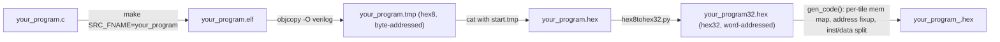

# Hex Files

Hex files are what actually gets loaded into a Pico (RISC-V) tile's instruction/data memory for simulation. Every entry in a testcase's `@pico_program` array is a hex file path, and `mosaic_2x2.pl`'s comment "Hex files can be generated and they will follow instructions written with C code" is exactly the process this page documents.

## How Hex File Generation Works

Hex file generation is a two-stage pipeline, driven from your testcase `.pl` script by calling `gen_code()` (imported from a `gen_hex.pm` module) once per accelerator/firmware directory:



1. **Compile** — `gen_code()` (in each firmware directory's `gen_hex.pm`) calls the Makefile in that directory (borrowed/adapted from the [picorv32](https://github.com/YosysHQ/picorv32) project) once **per pico tile** in your `@tile_array`:
   ```
   make clean
   make SRC_FNAME=<c_code>
   ```
   The Makefile compiles `<c_code>.c` with the RISC-V GCC toolchain (`riscv32-unknown-elf-gcc`), links it against `start.S`/`riscv.ld` (a minimal baremetal bootloader), and uses `objcopy -O verilog` to produce a byte-addressed ("hex8") Verilog memory image. `hex8tohex32.py` then repacks that into a word-addressed ("hex32") `<c_code>32.hex` file — the actual format `$readmemh` expects in the tile's instruction/data memories.

2. **Per-tile memory layout** — before compiling, `gen_code()` regenerates two files unique to each tile ID:
   - `mem_layout.ld` (via `gen_mem_map()`) — lists a linker memory region for every tile in the array (so the compiled code can reference other tiles' memory-mapped addresses), and marks the *current* tile's own `BOOT_LOADER`/`LOCAL_DATA`/`LOCAL_INST` regions.
   - `start.S` / `start.ld` (via `gen_start()`) — a small assembly bootstrap that zeroes all registers, sets up the stack pointer, and jumps into your compiled `main()`, passing the tile's own ID as `argv[1]` (this is exactly why every example C file starts with `int tile_id = atoi(argv[1]);`).

3. **Address fixup and inst/data split** — after compiling, `gen_code()` renames the output to `<c_code>32_<tile_id>.hex`, rewrites its base address back to `@00000` (`get_inst_data_mem()`), and splits it into a separate instruction-memory hex and data-memory hex where needed.

4. **Cleanup** — intermediate `.o`/`.elf`/`.tmp`/`start.*` files are deleted; if `keep => 1` is passed, the disassembly (`.dissasembled`) and ELF header dump (`.readelf`) for each tile are preserved in a `temp_files/` directory for debugging.

This entire process only applies to **`pico` tiles** — `gen_code()` walks the tile array and skips any position that isn't `'pico'`.

{: .note }
Some of the simplest testcases (e.g. `mosaic_2x2.pl`) skip this pipeline entirely and reference pre-built hex files already checked into `src/Tile.HDL/picorv32_tile/firmware/` (like `test_tile_nop.hex`). You only need `gen_code()` when you're compiling your **own** C source.

## Including Your Own C Code in a Testcase

To have a testcase compile and load your own C program, add a `gen_code()` block to your `.pl` script, following the pattern used by `mosaic_asa.pl` and other accelerator testcases:

1. **Create your C directory.** Copy an existing firmware directory (e.g. `tools/picorv_c/c_asa/`) to a new one, keeping its `Makefile`, `start.S`, `riscv.ld`, `gen_hex.pm`, and `mq.h`/`xcustom.h` (needed if you use `qPut`/`mPut`/etc.). Put your own `<my_program>.c` in there.

2. **Point your testcase at it**, near the top of the script:
   ```perl
   use lib "$ENV{PWD}";
   use lib "$ENV{PWD}/../picorv_c/c_myprogram";   # <- your new directory
   use gen_mosaic;
   use gen_hex;                                    # imports gen_code()
   use POSIX;
   ```

3. **Set the firmware path and C file name**, and generate the hex files before calling `gen_all()`:
   ```perl
   $path    = "$ENV{PWD}";
   $fw_path = "$path/../picorv_c/c_myprogram";
   $c_file  = "my_program";        # matches my_program.c, no extension

   $param{'firmware_path'} = $fw_path;

   chdir $fw_path or die "$!. $fw_path\n";
   %param_h;
   $param_h{'c_code'}     = $c_file;
   $param_h{'r'}          = $param{'r'};
   $param_h{'c'}          = $param{'c'};
   $param_h{'tile_array'} = \@tile_array;   # must already be defined
   $param_h{'keep'}       = 1;              # keep disassembly for debugging
   $param_h{'clean'}      = 1;              # clean stale hex files first
   gen_code(\%param_h);
   chdir $path or die "$!. $path\n";
   ```

4. **Reference the generated hex files in `@pico_program`.** `gen_code()` names its output `<c_code>32_<tile_id>.hex` before the final rename to `<c_code>_<tile_id>.hex` — check the exact filename it prints during generation, then list one entry per tile position (empty string `''` for non-`pico` tiles):
   ```perl
   @pico_program = ("${c_file}32_0.hex", '',
                     '', '');
   ```

5. **If your C code uses message-queue primitives** (`qPut`, `mPut`, `mGet`, etc.), `#include "mq.h"` — see [C Functions](../c-functions) for the available primitives.

{: .note }
`gen_code()` requires `%param_h{'c_code'}` at minimum; it defaults `r`/`c` to a 4x4 array if not provided. Always pass your testcase's actual `tile_array` so the per-tile memory map matches your mesh layout.

<div style="display: flex; justify-content: space-between;">
  <a href="{{ '/docs/mosaic-2x2' | relative_url }}" class="btn btn-light mr-2"><i class="fa-solid fa-arrow-left-long"></i> Go back</a>
  <a href="{{ '/docs/tutorial' | relative_url }}" class="btn btn-light mr-2"><i class="fa-solid fa-arrow-right-long"></i> Continue</a>
</div>
