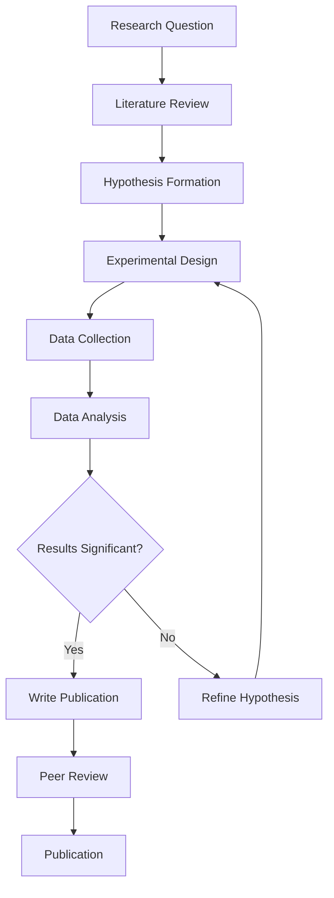
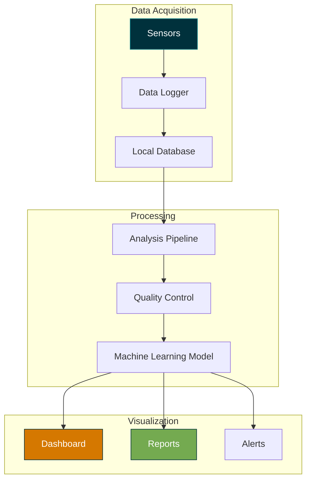
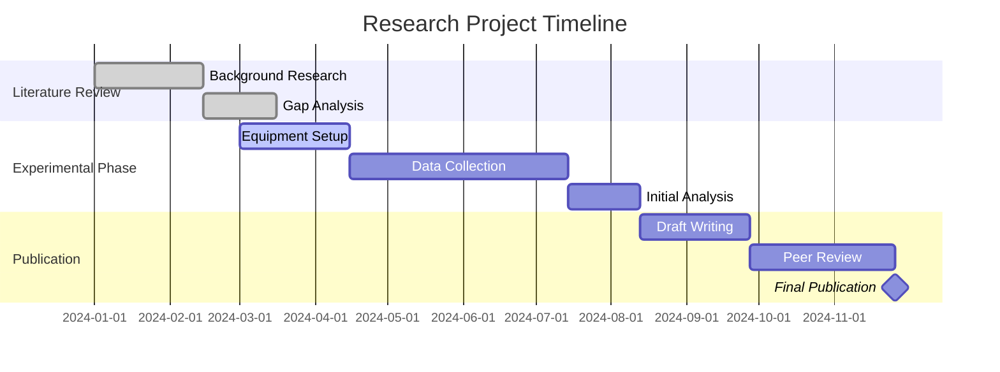
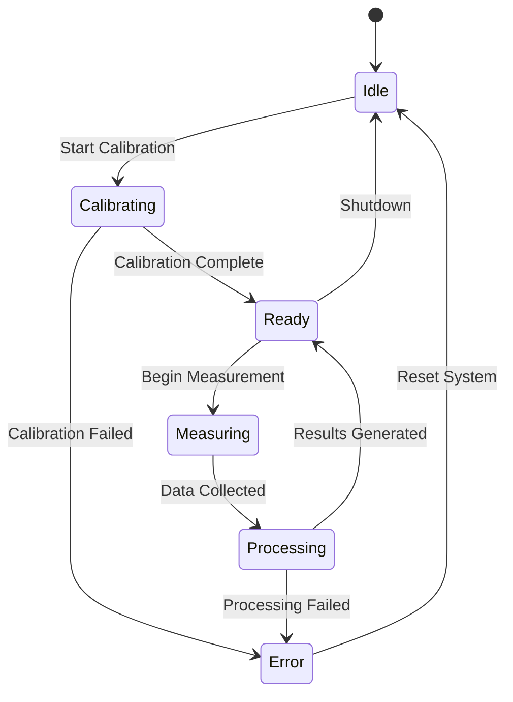
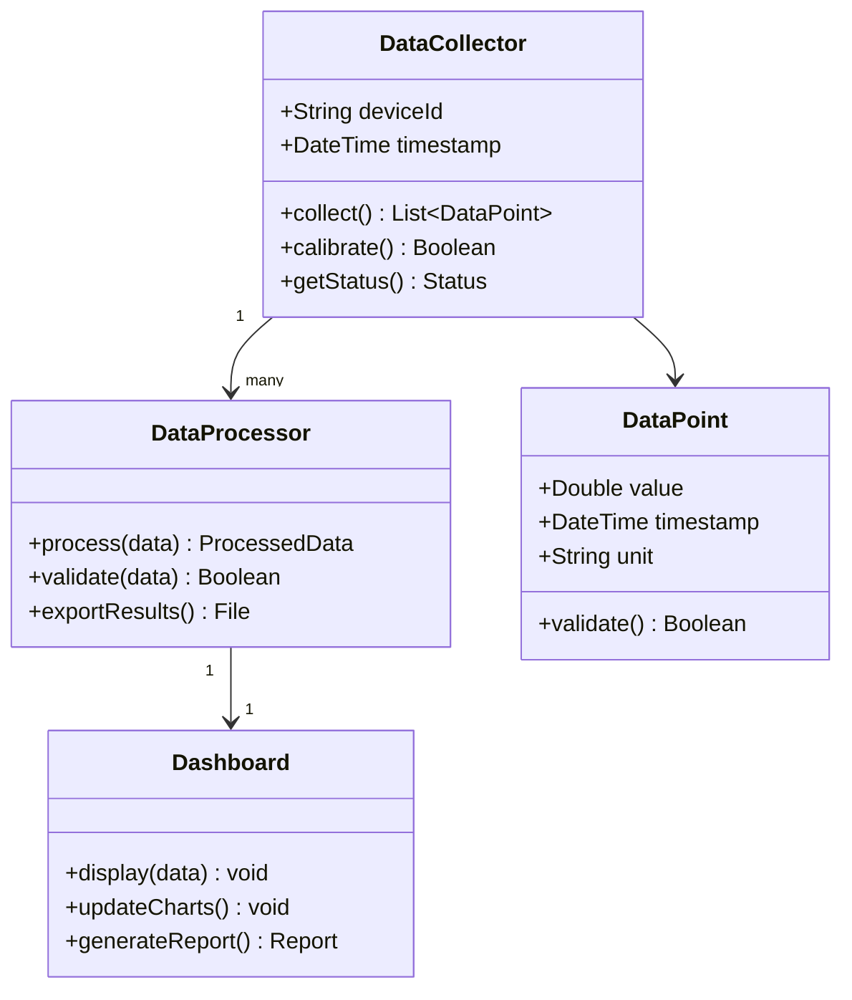
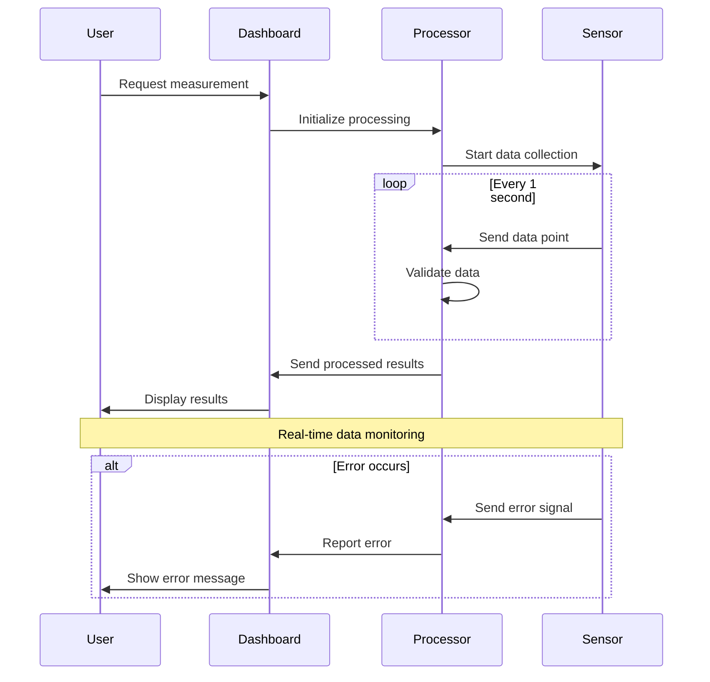
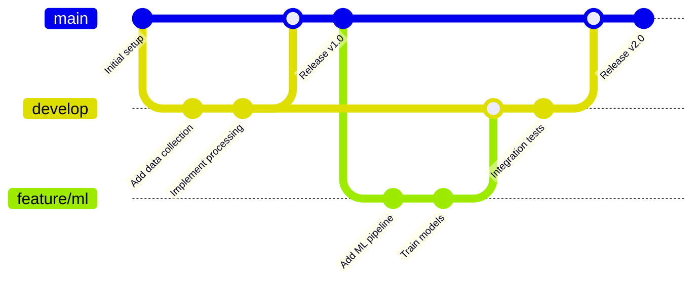

## Mermaid Diagram Examples

This page demonstrates the built-in Mermaid diagram support in the LBNL Jekyll template.

### Research Process Flowchart

### Laboratory System Architecture

### Project Timeline

### System State Diagram

### Class Diagram (Software Architecture)

### Sequence Diagram (User Interaction)

### Git Workflow

